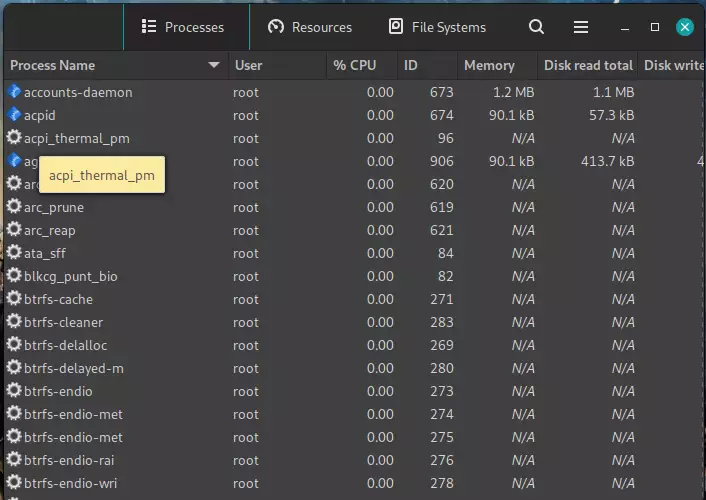
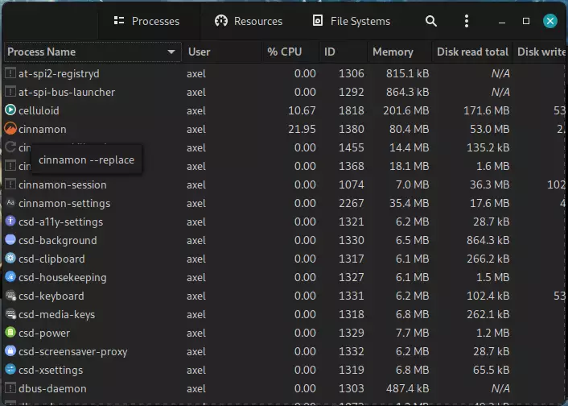

# Mint-Y theme tweaks
A collection of tweaks to the Mint-Y themes

## Requirements

```bash
sudo apt install git sassc inkscape optipng
```

## Usage
Clone this repo and run the mint-y-tweaks.sh script

Note: You will need an active internet connection for the script to download the themes

## Features

- Darker dark theme variant

- Remove highlight from HdyViewSwitcher buttons

- Tooltips follow the background color instead of always being yellow

### Before



### After


